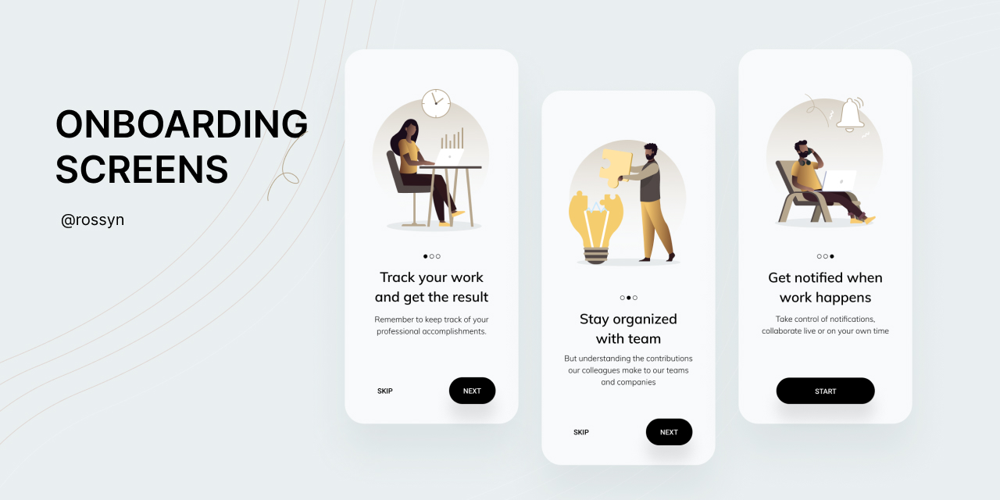

<h1 align="center">Onboarding Designs</h1>

✨ **Make a great first impression!** This repository features beautifully designed, lightweight, and
customizable onboarding screens to enhance your app's user experience. Built with modern Android
development tools, these screens are easy to integrate and adapt to your project.

### 📲 Screenshots
design-2



### 🤝 Contributing

Pull requests are welcome! Feel free to contribute to make these screens even better.

### Find this Repository useful? ❤️

Support it by joining stargazers for this repository. ⭐

Also, [follow me on GitHub](https://github.com/AndroidWithRossyn/) for my next creations! 🤩

### License

```
Copyright 2024 Rossyn

Licensed under the Apache License, Version 2.0 (the "License");
you may not use this file except in compliance with the License.
You may obtain a copy of the License at

   http://www.apache.org/licenses/LICENSE-2.0

Unless required by applicable law or agreed to in writing, software
distributed under the License is distributed on an "AS IS" BASIS,
WITHOUT WARRANTIES OR CONDITIONS OF ANY KIND, either express or implied.
See the License for the specific language governing permissions and
limitations under the License.
```

<p align="center">
  
</p>
